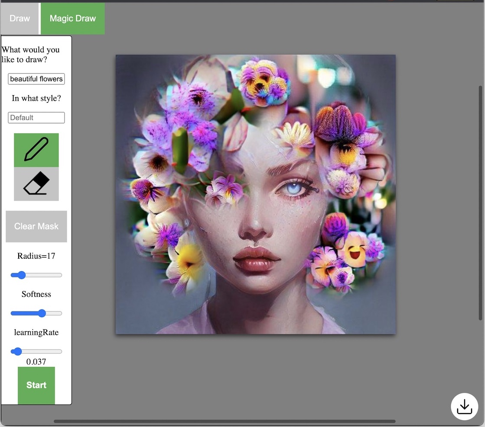

# ProsePainter 
Create images by ***painting with words***.

ProsePainter combines direct digital painting with real-time guided machine-learning based image optimization. Simply state what you want and draw the region where you want it. 

 
## Setup
The app consists of a python server which does the computations and a web based interface using a nodejs server.

### Install Python server
Due to the use of CLIP, it is recommended to use **python3.7** and **torch 1.7.1+cu110** (available [here](https://pytorch.org/get-started/previous-versions/)).

With the following command you can set up a conda environment named _prosepaint_ where all the dependencies will be installed.
```bash
conda env create -f server/env-server.yml
```

### Run Python server
The following command will launch the uvicorn server.
```bash
export PYTHONPATH=.; python server/server_deploy.py
```

### Install NodeJS server
```
cd client
npm install
```
### Run NodeJS server
```
cd client
npm run dev
```
Open http://localhost:8003/ in your web browser.

### Build and run with Docker

```
docker build . -t prosepainter:latest
docker run -p 8004:80 -v `pwd`/server:/server prosepainter:latest
```

Open http://localhost:8004/ in your web browser.